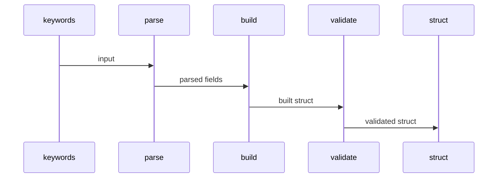
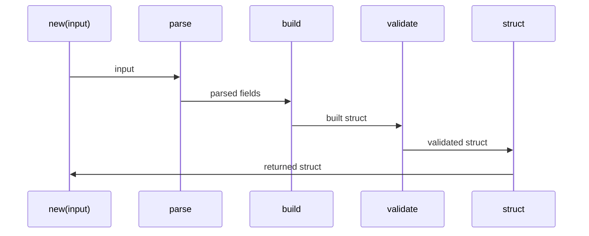
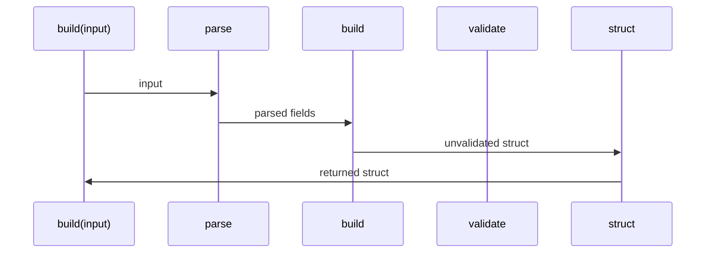
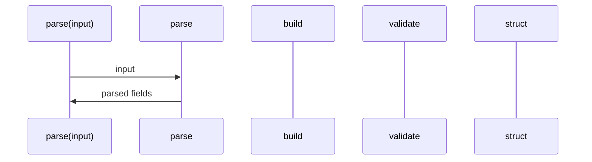
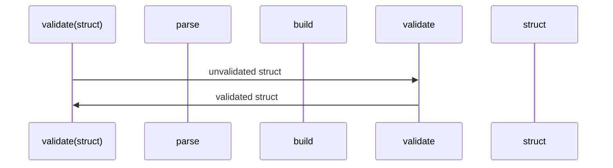
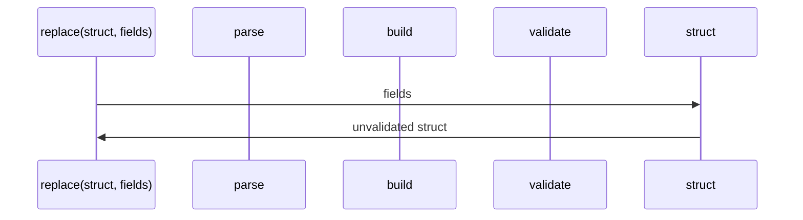
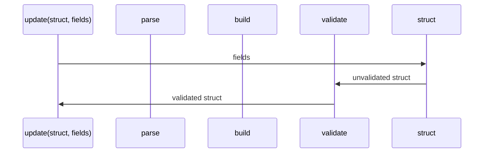
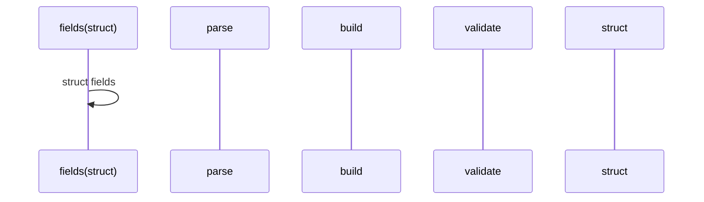
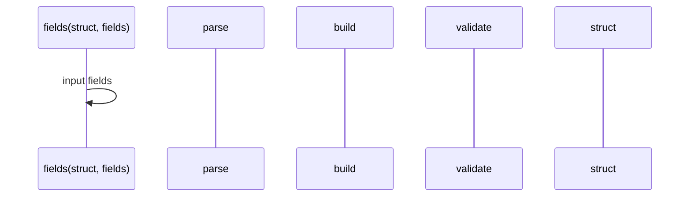

### Flow



### `Constructive.new(input)`



### `Constructive.build(input)`

#### Skips

- validating



<!-- ### `Constructive.create(fields)`

#### Skips

- parsing

```mermaid
sequenceDiagram
  rect rgb(255, 255, 255)

  participant call as create(fields)
  participant parse
  participant build
  participant validate
  participant struct

  call ->> build: fields
  build->>validate: unvalidated struct
  validate->> struct: validated struct
  struct ->> call: returned struct
end
``` -->

### `Constructive.from_keywords(fields)`

#### Skips

- parsing
- validating

```mermaid
sequenceDiagram
  rect rgb(255, 255, 255)

  participant call as build(fields)
  participant parse
  participant build
  participant validate
  participant struct

  call ->> build: fields
  build->>struct: unvalidated struct
  struct->> call: returned struct
end
```

### `Constructive.parse(input)`

#### Skips

- building
- validating



### `Constructive.validate(struct)`

#### Skips

- parsing
- building



### `Constructive.replace(struct, fields)`

#### Skips

- parsing
- building
- validating



### `Constructive.update(struct, fields)`

#### Skips

- building



### `Constructive.fields(struct)`

#### Skips

- parsing
- building
- validating



### `Constructive.input(struct)`

#### Skips

- parsing
- building
- validating


